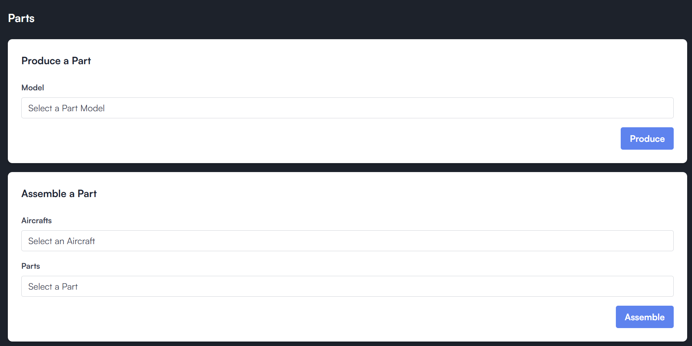
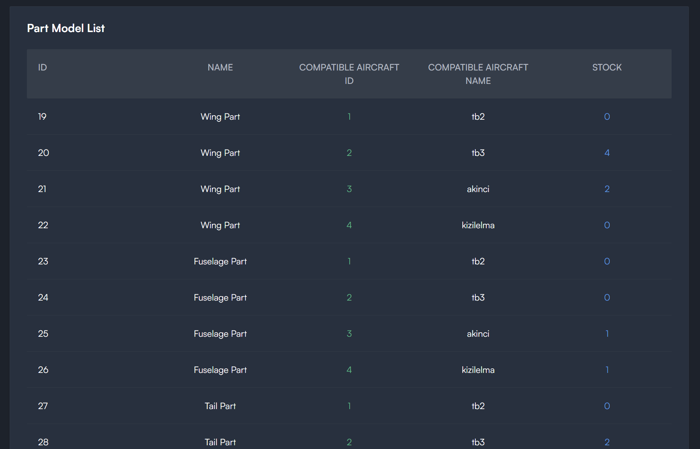
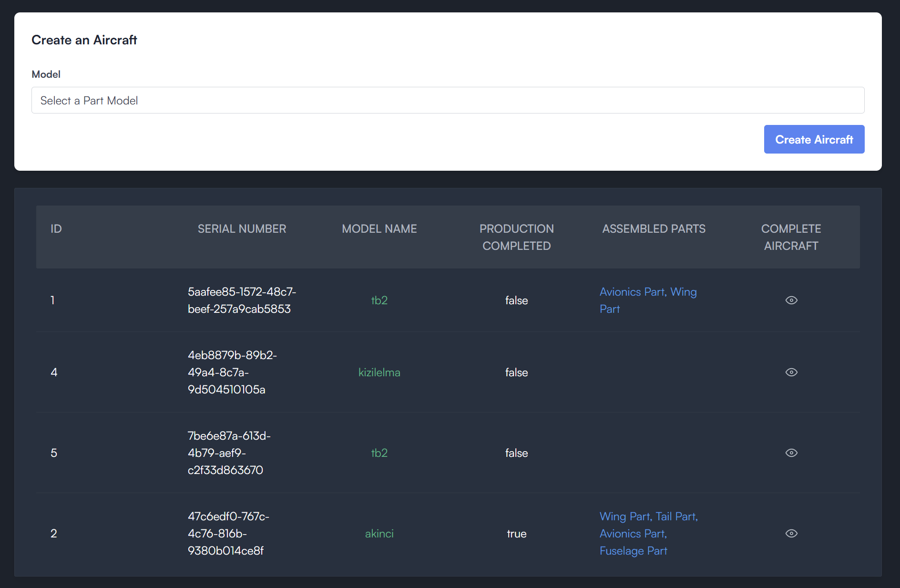
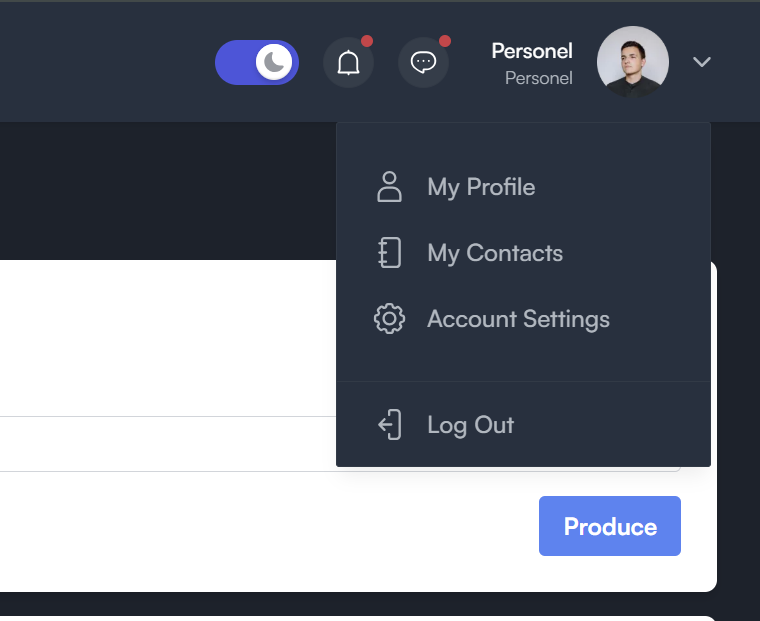

# Next.js Aircraft Production Frontend

It's a next js project to do these actions:

- Produce a Part
- List Parts
- Create an Aircraft
- Assemble a part to an Aircraft
  ...

## Login Page

## You can produce and assemble a part.

## You can see parts in stock and see their stock information.

## Also you can go detail of a part model by clicking one row.

## You can create an aircraft and list created aircrafts.

## You can logout by clicking logout button.

